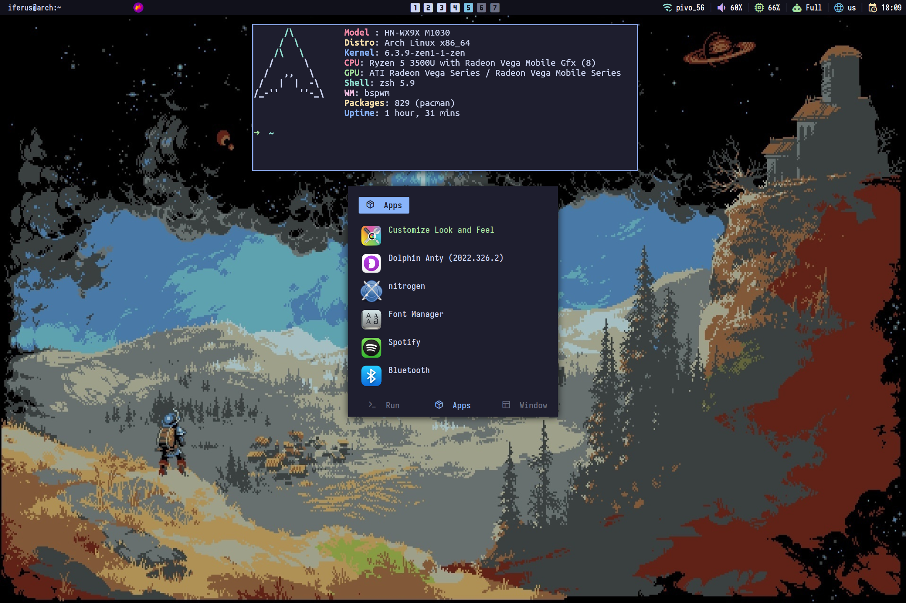

# Hi! It's my lightweight bspwm dots (:
## DEPENDENS: 
`yay -S bspwm sxhkd rofi dunst polybar neofetch kitty picom-pijulius-git xorg-xsetroot`

## THEME:
I'm using [Cattpucin](https://github.com/catppuccin/catppuccin) for all programs. Based on my color preference, I chose the Mocha palette.

**GTK THEME:**

[Cattpuccin-mocha](https://www.pling.com/p/1996672)

**Icons** : I'm use [Newaita Reborn Dark Fedora](https://github.com/cbrnix/Newaita-reborn) icons and for rofi I use [Colloid-Dark](https://github.com/vinceliuice/Colloid-icon-theme)

## Fonts:
[Iosevka](https://typeof.net/Iosevka/)

[Nerd Symbols Font](https://www.nerdfonts.com/)

## Screenshots: 

